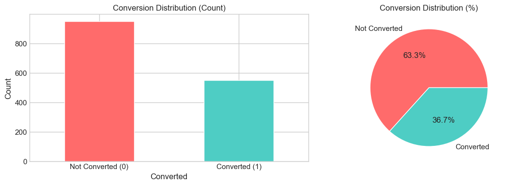
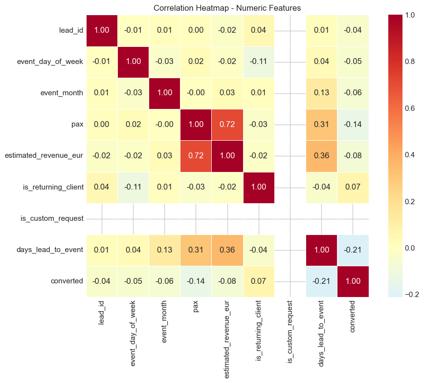
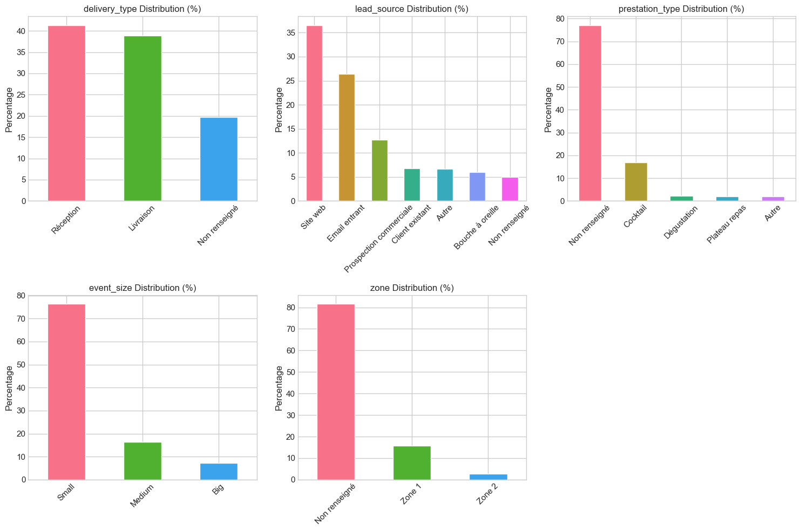
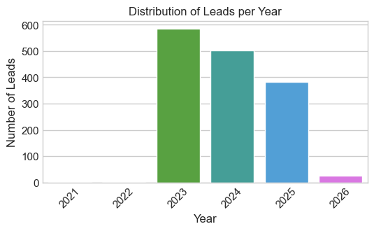
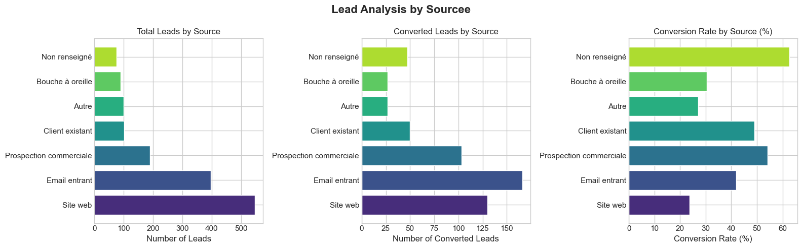
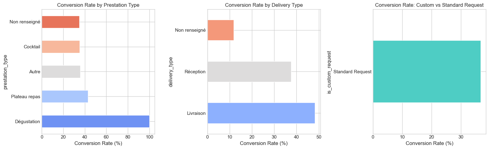
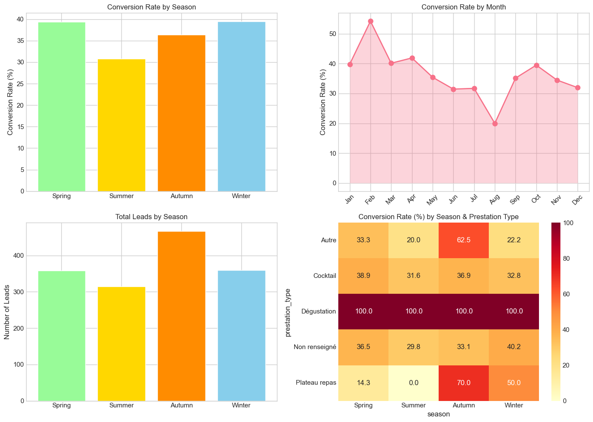
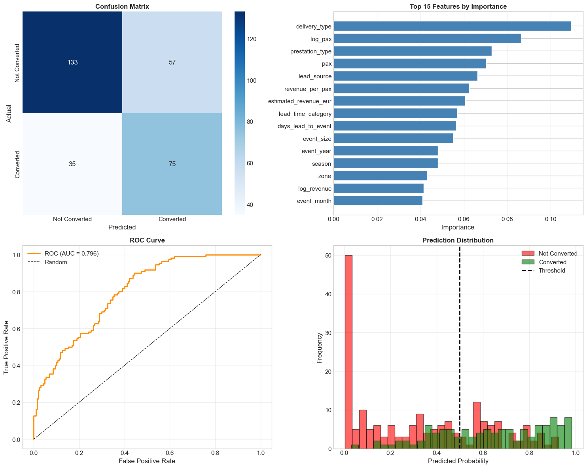

# Lead Conversion Analysis & Prediction
### Technical Assignment — MeetMyMama Company
**Candidate:** Abderaouf Khelfaoui | **Examiner:** Mr. Junned Mohammad

---

## Overview

This project presents a full end-to-end data analysis and machine learning pipeline to understand and predict lead conversion for **MeetMyMama**, a catering company operating in France. The work covers data cleaning, exploratory data analysis (EDA), business-driven analysis, and a predictive XGBoost classification model.

---

## Table of Contents

1. [Setup & Data Loading](#1-setup--data-loading)
2. [Data Cleaning & Feature Engineering](#2-data-cleaning--feature-engineering)
3. [Exploratory Data Analysis](#3-exploratory-data-analysis)
4. [Business Questions Analysis](#4-business-questions-analysis)
5. [XGBoost Predictive Model](#5-xgboost-predictive-model)
6. [Key Insights](#6-key-insights)
7. [Business Recommendations](#7-business-recommendations)

---

## 1. Setup & Data Loading

The dataset was loaded from `data.csv` using **pandas**. Visualizations were produced with **matplotlib** and **seaborn**.

**Dependencies:**
```
pandas, numpy, matplotlib, seaborn, scikit-learn, xgboost
```

---

## 2. Data Cleaning & Feature Engineering

Several transformations were applied to prepare the data:

- **`event_size`** — Events categorized into three tiers based on estimated revenue:
  - Small: < €5,000
  - Medium: €5,000 – €15,000
  - Big: > €15,000

- **`delivery_type`** — "Non renseigné" values were resolved using `prestation_type`:
  - "Offre réception" → "Réception"
  - "Offre livraison" → "Livraison"

- **`event_date`** — Converted to datetime; year and month extracted.

- **`prestation_type`** — "Offre livraison" and "Offre réception" entries unified under "Non renseigné" to avoid duplication.

---

## 3. Exploratory Data Analysis

### 3.1 Target Variable — Conversion Distribution



The dataset shows a notable **class imbalance**, with most leads not converting. The `scale_pos_weight` parameter in XGBoost was set accordingly to account for this.

---

### 3.2 Correlation Heatmap



The heatmap reveals correlations among numeric features. No single numeric feature dominates the prediction of conversion, pointing to the importance of categorical signals like `lead_source`, `prestation_type`, and `season`.

---

### 3.3 Categorical Feature Distributions



Distributions across `delivery_type`, `lead_source`, `prestation_type`, `event_size`, and `zone` show that:
- The majority of leads are for **small events**
- **Website and email** are the dominant lead sources
- **"Non renseigné"** is the most common prestation type

---

## 4. Business Questions Analysis

### 4.1 Lead Source Analysis

**Distribution of leads per year:**



The total number of leads has been on a **continuous decline year over year**, pointing to a need for improved acquisition strategy.

**Conversion by lead source:**



Websites and emails generate ~60% of leads but have lower conversion rates. Leads from **Prospection Commerciale** and **Existing Clients** convert at a significantly higher rate.

---

### 4.2 Prestation Type Analysis

**Question:** What type of prestation converts the most? What is its delivery type? Is it a custom request?



- **Cocktail**, **Dégustation**, and **Non renseigné** are the top three by number of conversions.
- Deliveries via **Livraison** lead overall conversion counts, followed by **Réception**.
- Custom requests show a meaningful lift in conversion rate compared to standard requests.

---

### 4.3 Seasonality Analysis

**Question:** Is there a relationship between event month/season and conversion?



- **Winter** achieves the highest conversion rate (~40%), driven by **Plateau repas** requests.
- **February** is the single peak conversion month; **August** is the slowest.
- **Summer** consistently shows the lowest conversion performance.

---

## 5. XGBoost Predictive Model

An **XGBoost classifier** was trained to predict lead conversion probability, enabling sales teams to prioritize high-value leads.

### Feature Engineering for Modeling

Beyond the cleaned columns, additional features were derived:
- `revenue_per_pax` — Revenue per attendee
- `log_revenue` / `log_pax` — Log-transformed versions to handle skew
- `is_weekend` — Whether the event falls on a weekend
- `lead_time_category` — Bucketed lead time: Last-minute / Short / Medium / Long

### Model Configuration

```python
XGBClassifier(
    n_estimators=200,
    max_depth=6,
    learning_rate=0.05,
    subsample=0.8,
    colsample_bytree=0.8,
    min_child_weight=3,
    gamma=0.1,
    scale_pos_weight=<class_ratio>  # handles class imbalance
)
```

### Model Results



The output panel shows:
- **Confusion Matrix** — true/false positive breakdown
- **Top 15 Feature Importances** — key drivers of prediction
- **ROC Curve** — overall discriminative power
- **Prediction Probability Distribution** — separation between converted and non-converted leads

---

## 6. Key Insights

### Lead Sources
- Websites and emails generate ~60% of leads, but **Prospection Commerciale** and **Existing Clients** have significantly better conversion rates.
- The most common service type among these leads is **Non renseigné**.

### Event Size
- **~75% of leads are for small events** (< €5,000). Medium and large events represent 12% and 8% respectively.

### Service Type
- **Cocktail, Dégustation, and Plateau repas** convert well across all seasons.
- Top three by conversion volume: **Non renseigné, Cocktail, Dégustation**.

### Seasonality
- **Winter** (peak: February) → highest conversion (~40%)
- **Spring / Autumn** → moderate conversion
- **Summer** (trough: August) → lowest conversion

### High-Conversion Lead Profile
A lead likely to convert shares these characteristics:
- Source: Prospection Commerciale or Existing Client
- Service: Cocktail, Dégustation, or Plateau repas
- Event size: Small to Medium
- Season: Winter or February

---

## 7. Business Recommendations

### Deployment Strategy
1. Use the model's predicted conversion score to **prioritize outreach** — focus the commercial team on high-probability leads first.
2. Use scores to guide **offer customization** (tailor proposals to needs most correlated with conversion).
3. Feed new interaction outcomes back into the database to continuously update predictions.

### Suggested KPIs
- Actual vs. predicted conversion rate (model calibration)
- Growth rate in targeted segments (strategy effectiveness)
- Average time-to-conversion (sales cycle efficiency)

### Data Gaps to Address
- **Client data** — needed for proper segmentation and CRM integration
- **Food/menu type** — would clarify specialty positioning
- **Exact event location** — valuable for geo-targeted advertising and identifying high-density opportunity zones

### Social Media Observation
A review of social media presence reveals:
- Instagram: 18.6k followers | TikTok: 3k | Facebook: 13k
- Typical post engagement stays below 7k views
- One influencer collaboration reached **3M views** — indicating high potential if influencer strategy is scaled

---

## Project Structure

```
.
├── data.csv                                      # Raw input data
├── Abderaouf_KHELFAOUI_DATA_AI_Engineer_.ipynb   # Full analysis notebook
└── README.md                                     # This file
```

---

*Assignment completed for MeetMyMama Company — Abderaouf Khelfaoui*
